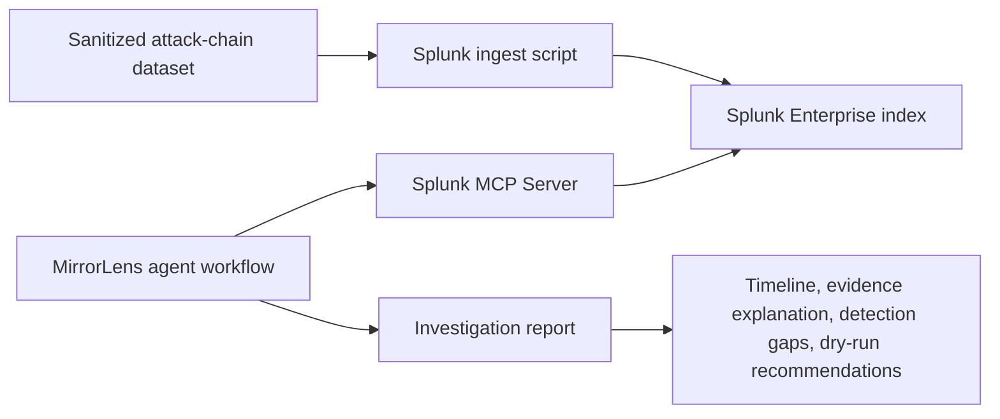

# Architecture Diagram

MirrorLens treats Splunk as the source of truth. The agent uses Splunk MCP
Server to discover data, run investigation searches, explain the evidence, and
produce auditable recommendations.
