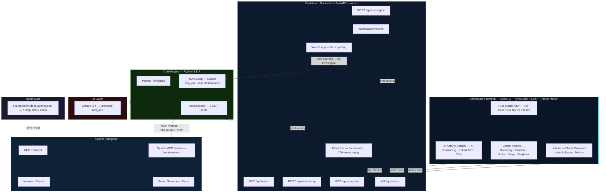
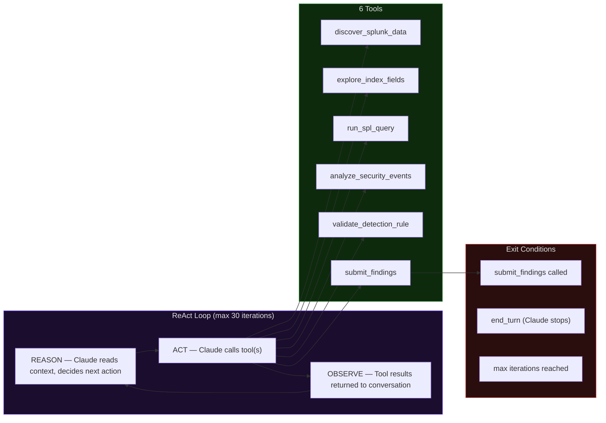
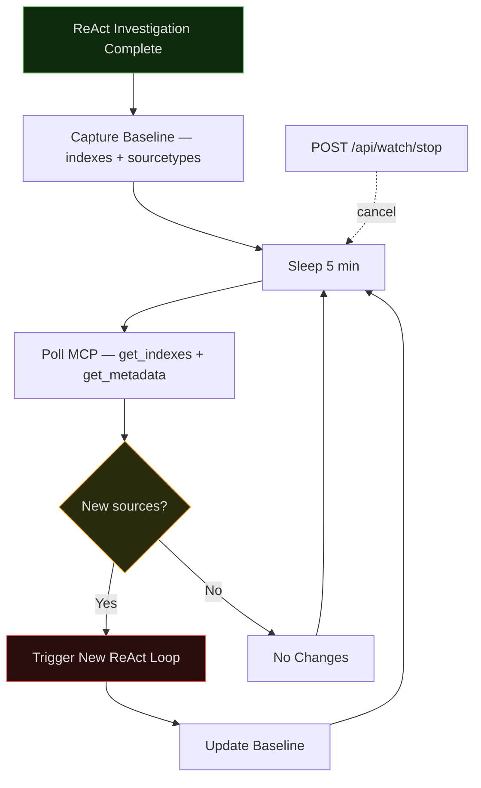

# Architecture Diagram

> [中文版](architecture_diagram.zh.md)

## System Overview

---

## ReAct Loop Detail

---

## Continuous Watch Mode

---

## EventBus Channels

| Channel | Payload Description |
|---------|---------------------|
| `phase` | Phase name + status (pending/running/done) |
| `mcp_call` | MCP tool name, SPL query, status, row count, error |
| `ai_call` | ReAct reasoning type, iteration, reasoning text, stage results |
| `discovery` | Server info, indexes, hosts, sourcetypes, field discovery |
| `evidence` | Query results, collection status |
| `analysis` | Timeline, gaps, use cases, rule validations |
| `recommendation` | Response actions, executive summary, risk level |
| `status` | Started/completed/error with elapsed time |
| `watch` | Watch lifecycle events (started, checking, changes_detected, stopped) |

---

## MCP Tools Mapping

| MirrorLens Tool | MCP Server Calls | Phase |
|-----------------|-----------------|-------|
| `discover_splunk_data` | `get_info` + `get_indexes` + `get_metadata(hosts)` + `get_metadata(sourcetypes)` + `get_knowledge_objects(saved_searches)` + `get_knowledge_objects(alerts)` | Discover |
| `explore_index_fields` | `run_query("search index={name} \| fieldsummary")` + `run_query("search index={name} \| head 3")` | Discover |
| `run_spl_query` | `run_query(spl)` | Investigate |
| `analyze_security_events` | Claude API (no MCP) | Analyze |
| `validate_detection_rule` | `run_query(spl)` | Validate |
| `submit_findings` | None (local aggregation) | Submit |

---

## Key Design Decisions

| Decision | Rationale |
|----------|-----------|
| **MCP-first** | All Splunk interaction through official MCP Server — no direct REST API. Ensures protocol compliance and bonus prize eligibility. |
| **ReAct over pipeline** | Claude autonomously decides investigation path instead of hardcoded phases. More adaptive to unknown data shapes. |
| **AI-advisory** | All analysis is read-only. No automated responses executed. Human review required. |
| **Live rule validation** | Generated rules tested against real Splunk data, not just syntax checked. Proves detection viability. |
| **Continuous watch** | Lightweight MCP polling detects new data sources without constant full investigation. Cost-effective 24/7 monitoring. |
| **EventBus architecture** | Decouples investigation engine from dashboard delivery. Supports WebSocket streaming + snapshot replay. |
| **Secrets isolated** | All credentials in `.env` (gitignored). Code references only environment variables. |
