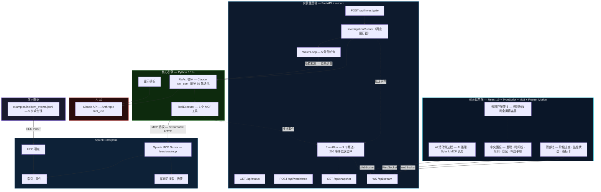
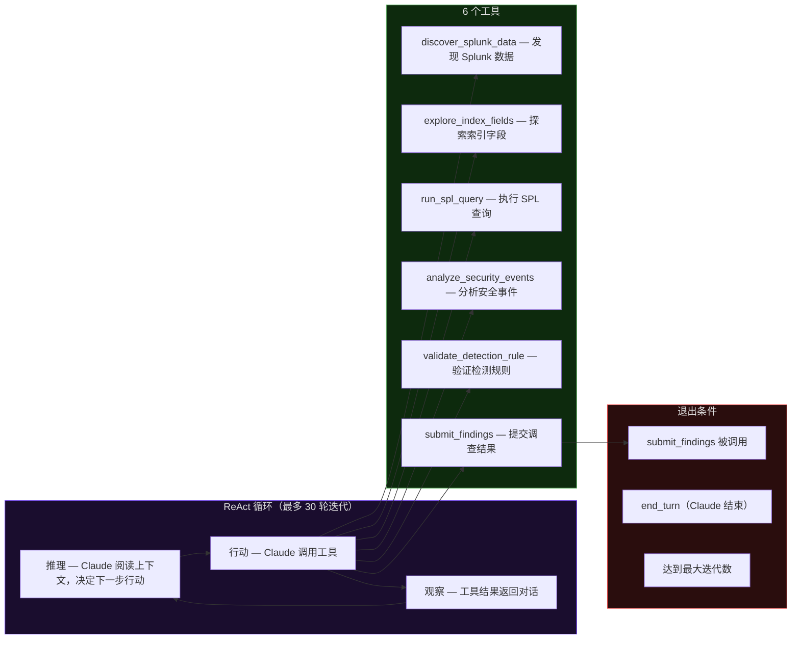
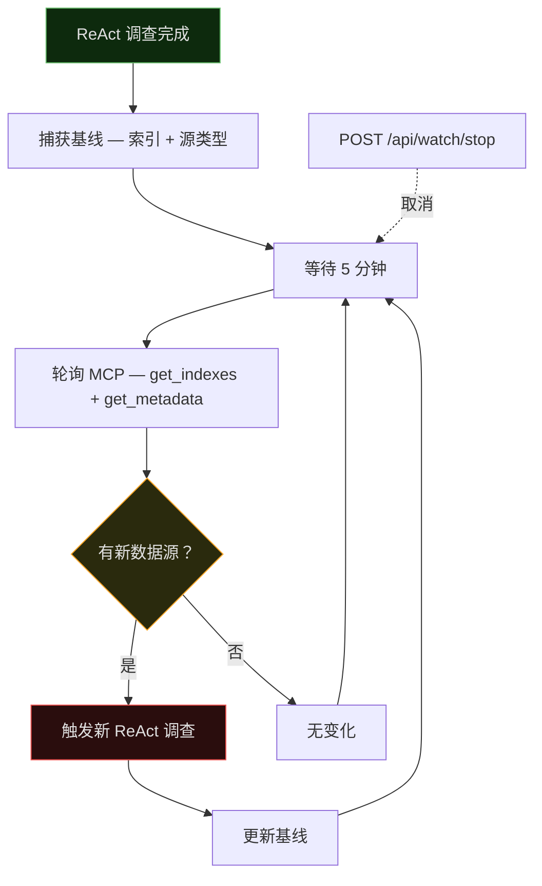

# 架构图

> [English](architecture_diagram.md)

## 系统总览

---

## ReAct 循环详情

---

## 持续监控模式

---

## EventBus 频道

| 频道 | 负载描述 |
|------|----------|
| `phase` | 阶段名称 + 状态（pending/running/done） |
| `mcp_call` | MCP 工具名、SPL 查询、状态、行数、错误 |
| `ai_call` | ReAct 推理类型、迭代数、推理文本、阶段结果 |
| `discovery` | 服务器信息、索引、主机、源类型、字段发现 |
| `evidence` | 查询结果、采集状态 |
| `analysis` | 时间线、检测盲区、用例、规则验证 |
| `recommendation` | 响应操作、执行摘要、风险等级 |
| `status` | 开始/完成/错误及耗时 |
| `watch` | 监控生命周期事件（started, checking, changes_detected, stopped） |

---

## MCP 工具映射

| MirrorLens 工具 | MCP 服务调用 | 阶段 |
|----------------|------------|------|
| `discover_splunk_data` | `get_info` + `get_indexes` + `get_metadata(hosts)` + `get_metadata(sourcetypes)` + `get_knowledge_objects(saved_searches)` + `get_knowledge_objects(alerts)` | 发现 |
| `explore_index_fields` | `run_query("search index={name} \| fieldsummary")` + `run_query("search index={name} \| head 3")` | 发现 |
| `run_spl_query` | `run_query(spl)` | 调查 |
| `analyze_security_events` | Claude API（无 MCP） | 分析 |
| `validate_detection_rule` | `run_query(spl)` | 验证 |
| `submit_findings` | 无（本地聚合） | 提交 |

---

## 关键设计决策

| 决策 | 原因 |
|------|------|
| **MCP 优先** | 所有 Splunk 交互通过官方 MCP Server，确保协议合规和奖项资格 |
| **ReAct 而非管道** | Claude 自主决定调查路径，对未知数据结构更具适应性 |
| **AI 建议性** | 所有分析均为只读，不执行自动响应，需人工审核 |
| **实时规则验证** | 生成的规则在真实 Splunk 数据上验证，不仅检查语法，证明检测可行性 |
| **持续监控** | 轻量 MCP 轮询发现新数据源，无需持续完整调查，高性价比 7×24 监控 |
| **EventBus 架构** | 将调查引擎与仪表盘解耦，支持 WebSocket 流式推送和快照重放 |
| **密钥隔离** | 所有凭证在 `.env` 中（已 gitignore），代码仅引用环境变量 |
